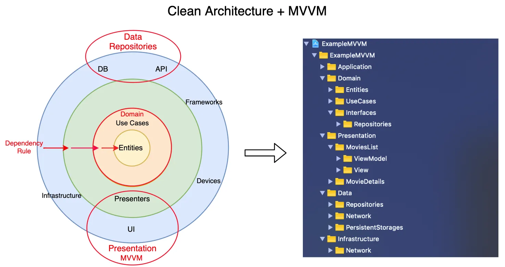
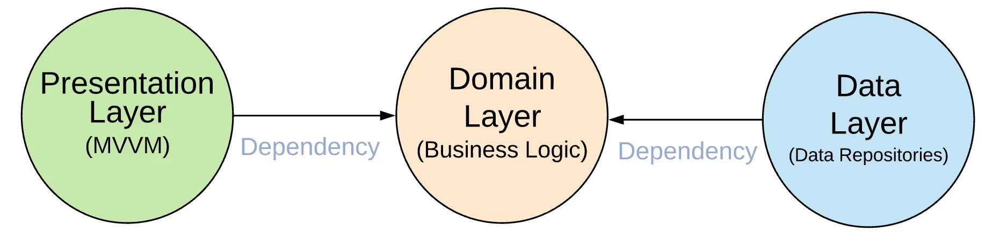

# Clean Architecture

# Layers
We have different layers in the application. **The main rule is not to have dependencies from inner layers to outers layers**.

## Domain Layer (Business logic)
Domain Layer is **not depend** on any **other layers** and should not include anything from other layers (e.g Presentation — UIKit or SwiftUI or Data Layer — Mapping Codable).

> My thoughts about Domain Layer is; Domain Layer is **intermediate layer** between Presentation Layer and Data Layer. means that if Presentation Layer want to get some data then it will ask Domain Layer and the Domain layer will ask Data Layer then Domain Layer will return the result from the Data Layer to Presentation Layer.

Contain:
- Entities (Business Models)
- Use Cases (Interactors)
    - A UseCase can depend on other UseCases.
- Repository **Interfaces**

## Presentation Layer
Presentation Layer **depends only** on the **Domain Layer**.

Contain:
- UI (UIViewControllers or SwiftUI Views)
- ViewModel
- Router or Coordinator

## Data Layer
Data Layer (Data Repositories Layer) **depends only** on the **Domain Layer**.

Contain:
- Repository **Implementations**
- API (Network)
- Persistence DataBase