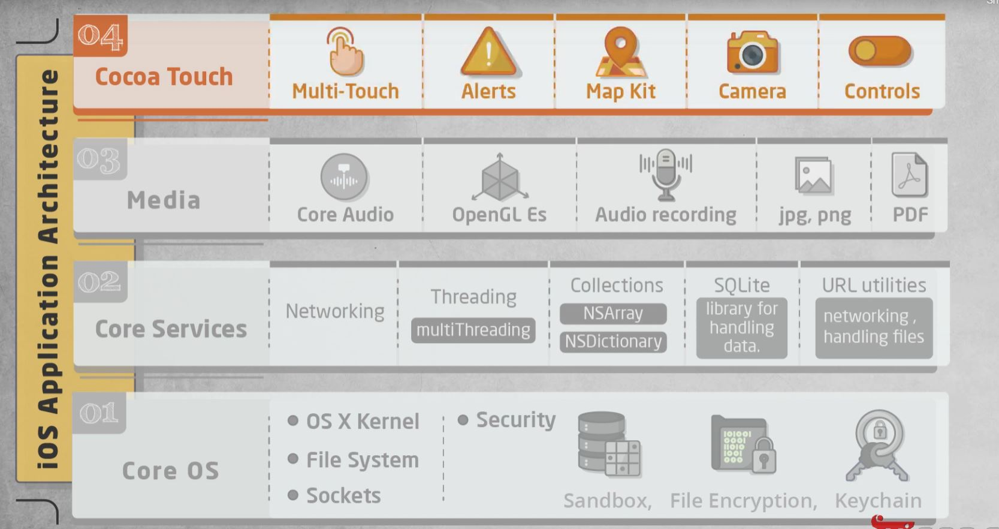

# Architecture of iOS Operating System

The structure of the iOS operating System is Layered based. Its communication doesn’t occur directly. The layer’s between the Application Layer and the Hardware layer will help for Communication. The lower level gives basic services on which all applications rely and the higher-level layers provide graphics and interface-related services. Most of the system interfaces come with a special package called a framework.

### CORE OS Layer:
All the iOS technologies are built under the lowest level layer i.e. Core OS layer. These technologies include:

 - Core Bluetooth Framework
 - External Accessories Framework
 - Accelerate Framework
 - Security Services Framework
 - Local Authorization Framework etc.

It supports 64-Bit (from IOS7) which enables the application to run faster.

### Core Services Layer
Some of the Important Frameworks available in the CORE SERVICES Layer which helps the iOS operating system to cure itself and provide better functionality. It is the 2nd lowest layer in the Architecture as shown above. Below are some important frameworks present in this layer:

 - Core Foundation Framework: This framework provides data management and service features for iOS applications.
 - Foundation Framework: Objective-C covering too many of the features found in the Core Foundation framework.
 - Core Location Framework: This framework helps to provide the location and heading information to the application.
 - Core Data Framework: This is the technology that is used for managing the data model of a Model View Controller app.
 - Address Book Framework: The Address Book Framework provides access to the contact details of the user.
 - Cloud Kit Framework: This framework provides a medium for moving data between your app and iCloud.
 - Core Motion Framework: All the motion-based data on the device is accessed with the help of the Core Motion Framework.
 - HealthKit Framework: This framework handles the health-related information of the user.
 - HomeKit Framework: This framework is used for talking with and controlling connected devices with the user’s home.
 - Social Framework: It is simply an interface that will access users’ social media accounts.
 - StoreKit Framework: This framework supports for buying of contents and services from inside iOS apps.
 
### Media Layer
With the help of the media layer, we will enable all graphics video, and audio technology of the system. This is the second layer in the architecture. The different frameworks of MEDIA layers are:
 
 
 - ULKit Graphics: This framework provides support for designing images and animating the view content.
 - Core Graphics Framework: This framework support 2D vector and image-based rendering ad it is a native drawing engine for iOS.
 - Core Animation: This framework helps in optimizing the animation experience of the apps in iOS.
 - Media Player Framework: This framework provides support for playing the playlist and enables the user to use their iTunes library.
 - AV Kit: This framework provides various easy-to-use interfaces for video presentation, recording, and playback of audio and video.
 - Open AL: This framework is an Industry Standard Technology for providing Audio.
 - Core Images: This framework provides advanced support for motionless images.
 - GL Kit: This framework manages advanced 2D and 3D rendering by hardware-accelerated interfaces.

### COCOA Touch Layer
COCOA Touch is also known as the application layer which acts as an interface for the user to work with the iOS Operating system. It supports touch and motion events and many more features. The COCOA TOUCH layer provides the following frameworks :
 
 - EvenKit Framework: This framework shows a standard system interface using view controllers for viewing and changing events.
 - GameKit Framework: This framework provides support for users to share their game-related data online using a Game Center.
 - MapKit Framework: This framework gives a scrollable map that one can include in your user interface of the app.
 - PushKit Framework: This framework provides registration support.
 
 
